Based on the Titanic Competition on Kaggle [Kaggle Competition: Titanic Machine Learning from Disaster](https://www.kaggle.com/c/titanic#description)

*by Curtis Gibeom Kim*

*March 2017*

## 1. Introduction

### 1.1 Goal
It is your job to predict if a passenger suvived the sinking of the Titanic or not.
For each Passengerld in the test set, you must predict a 0 or 1 value for the survived variable.
More Inforamation: [Kaggle Competition: Titanic Machine Learning from Disaster](https://www.kaggle.com/c/titanic#description)


### 1.2 Dataset
- Training set + [feature engineering](https://triangleinequality.wordpress.com/2013/09/08/basic-feature-engineering-with-the-titanic-data/)
- Test set

### 1.3 Data Dictionary
- Survived:	Survived or Not	
- Pclass:	Ticket class(1st = Upper, 2nd = Middle, 3rd = Lower)
- Sex:	    Sex(Male or Female)
- Age:	    Age in years
- SibSp:	the number of siblings and spouses aboard the Titanic (Sibling and Spouse)	
- Parch:	the number of parents and children aboard the Titanic (Parent and Child)
- Ticket:	Ticket number	
- Fare:     Passenger fare	
- Cabin:	Cabin number	
- Embarked:	Port of Embarkation	

- 1 = 1st, 2 = 2nd, 3 = 3rd
- 0 = No, 1 = Yes
- C = Cherbourg, Q = Queenstown, S = Southampton


- Continuous variables: Age, Fare
- Categorical variables: Pclass, Sex, Cabin, Embarked, SibSp and Parch

### 1.4 Import libraries


```python
import numpy as np
import pandas as pd
import string
import seaborn as sns
from sklearn import preprocessing
from sklearn.preprocessing import OneHotEncoder
## Model
from sklearn.linear_model import LogisticRegression
from sklearn.svm import SVC, LinearSVC
from sklearn.ensemble import RandomForestClassifier, ExtraTreesClassifier
from sklearn.naive_bayes import GaussianNB
## Evaluation
from sklearn.model_selection import train_test_split
from sklearn.model_selection import cross_val_score

```

_ _ _

## 2. Understand dataset
### 2.1 Data load and Descriptive statistics

To begin with, we need to understand titanic dataset. 
There are two types of dataset, the first one is train dataset which has 891 observations of 12 variables and the second one is test data has 418 observations of 11 variables. Also it should be needed to check missing values in obsevations


```python
df_original = pd.read_csv('train.csv')
df_test = pd.read_csv('test.csv')
```


```python
df_original.shape
```


    (891, 12)


```python
df_test.shape
```


    (418, 11)


```python
df_original.info()
```

    <class 'pandas.core.frame.DataFrame'>
    RangeIndex: 891 entries, 0 to 890
    Data columns (total 12 columns):
    PassengerId    891 non-null int64
    Survived       891 non-null int64
    Pclass         891 non-null int64
    Name           891 non-null object
    Sex            891 non-null object
    Age            714 non-null float64
    SibSp          891 non-null int64
    Parch          891 non-null int64
    Ticket         891 non-null object
    Fare           891 non-null float64
    Cabin          204 non-null object
    Embarked       889 non-null object
    dtypes: float64(2), int64(5), object(5)
    memory usage: 83.6+ KB


```python
df_original.describe()
```


<div>
<table border="1" class="dataframe">
  <thead>
    <tr style="text-align: right;">
      <th></th>
      <th>PassengerId</th>
      <th>Survived</th>
      <th>Pclass</th>
      <th>Age</th>
      <th>SibSp</th>
      <th>Parch</th>
      <th>Fare</th>
    </tr>
  </thead>
  <tbody>
    <tr>
      <th>count</th>
      <td>891.000000</td>
      <td>891.000000</td>
      <td>891.000000</td>
      <td>714.000000</td>
      <td>891.000000</td>
      <td>891.000000</td>
      <td>891.000000</td>
    </tr>
    <tr>
      <th>mean</th>
      <td>446.000000</td>
      <td>0.383838</td>
      <td>2.308642</td>
      <td>29.699118</td>
      <td>0.523008</td>
      <td>0.381594</td>
      <td>32.204208</td>
    </tr>
    <tr>
      <th>std</th>
      <td>257.353842</td>
      <td>0.486592</td>
      <td>0.836071</td>
      <td>14.526497</td>
      <td>1.102743</td>
      <td>0.806057</td>
      <td>49.693429</td>
    </tr>
    <tr>
      <th>min</th>
      <td>1.000000</td>
      <td>0.000000</td>
      <td>1.000000</td>
      <td>0.420000</td>
      <td>0.000000</td>
      <td>0.000000</td>
      <td>0.000000</td>
    </tr>
    <tr>
      <th>25%</th>
      <td>223.500000</td>
      <td>0.000000</td>
      <td>2.000000</td>
      <td>20.125000</td>
      <td>0.000000</td>
      <td>0.000000</td>
      <td>7.910400</td>
    </tr>
    <tr>
      <th>50%</th>
      <td>446.000000</td>
      <td>0.000000</td>
      <td>3.000000</td>
      <td>28.000000</td>
      <td>0.000000</td>
      <td>0.000000</td>
      <td>14.454200</td>
    </tr>
    <tr>
      <th>75%</th>
      <td>668.500000</td>
      <td>1.000000</td>
      <td>3.000000</td>
      <td>38.000000</td>
      <td>1.000000</td>
      <td>0.000000</td>
      <td>31.000000</td>
    </tr>
    <tr>
      <th>max</th>
      <td>891.000000</td>
      <td>1.000000</td>
      <td>3.000000</td>
      <td>80.000000</td>
      <td>8.000000</td>
      <td>6.000000</td>
      <td>512.329200</td>
    </tr>
  </tbody>
</table>
</div>


```python
df_original.isnull().sum()
```


    PassengerId      0
    Survived         0
    Pclass           0
    Name             0
    Sex              0
    Age            177
    SibSp            0
    Parch            0
    Ticket           0
    Fare             0
    Cabin          687
    Embarked         2
    dtype: int64


```python
df_test.isnull().sum()
```


    PassengerId      0
    Pclass           0
    Name             0
    Sex              0
    Age             86
    SibSp            0
    Parch            0
    Ticket           0
    Fare             1
    Cabin          327
    Embarked         0
    dtype: int64


### 2.2 Drop unnecessary variables


```python
df_original = df_original.drop(['PassengerId', "Name", "Ticket"], axis = 1)
df_test = df_test.drop(["Name", "Ticket"], axis = 1)
```

### 2.3 Imputing missing values
We need to fill missing values with mean, median, or mode values.
- Missing value list: Age, Embarked, Cabin, Fare

    1. Age will be filled with mean values
    2. Embarked will be filled with mode values
    3. Cabin will be filled with Null
    4. Fare will be filled with median values


```python
#Training Dataset
df_original.Age = df_original.Age.fillna(np.mean(df_original.Age))
df_original.Embarked = df_original.Embarked.fillna(df_original.Embarked.mode()[0][0])
df_original.Cabin = df_original.Cabin.fillna("Unknown")
#Test Dataset
df_test.Age = df_test.Age.fillna(np.mean(df_test.Age))
df_test.Cabin = df_test.Cabin.fillna("Unknown")
df_test.Fare = df_test.Fare.fillna(df_test["Fare"].median())
```

### 2.4 Converting Age and Fare data to intager
As in the descriptive statistics, minimum of "Age" is 0.42, so we need to convert float data type into int data type.


```python
# Training Data
df_original.Fare = df_original.Fare.astype(int)
df_original.Age = df_original.Age.astype(int)
# Test Data
df_test.Fare = df_test.Fare.astype(int)
df_test.Age = df_test.Age.astype(int)
```

_ _ _

## 3. Visualization

### 3.1 Continuous variables
#### 3.1.1 "Age" and "Fare"


```python
sns.set(style = "white", palette = 'muted', color_codes = True)
fig, ax = plt.subplots(1,2, figsize=(12,7), sharex = True)
sns.despine(left=True)

sns.distplot(df_original['Age'],kde = True, color = 'y', ax=ax[0])
sns.distplot(df_original['Fare'], bins=20, kde = True, color = 'g', ax=ax[1])
```


    <matplotlib.axes._subplots.AxesSubplot at 0x7f2b4affe750>


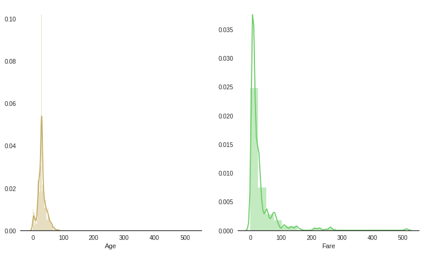


"Age" and "Fare" are needed to do feature scaling 


```python
# Training dataset
o_standard_scale = preprocessing.StandardScaler().fit(df_original[["Age", "Fare"]])
df_original_std_Age_Fare=o_standard_scale.transform(df_original[["Age", "Fare"]])
# Test dataset
t_standard_scale = preprocessing.StandardScaler().fit(df_test[["Age", "Fare"]])
df_test_std_Age_Fare=t_standard_scale.transform(df_test[["Age", "Fare"]])
```

### 3.2 Categorical variables
#### 3.2.1 "Sex"


```python
sns.countplot(x="Sex", data=df_original, palette="Blues_d")
```


    <matplotlib.axes._subplots.AxesSubplot at 0x7f2b503b2350>


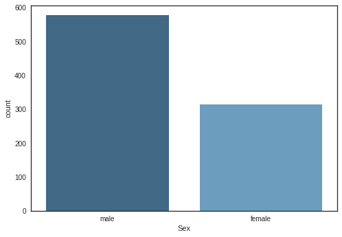


#### 3.2.2 "Pclass"
[1, 2, 3], the values have no meaning of their own number. They are needed to comvert dummies values.


```python
sns.countplot(x="Pclass", data=df_original)
```


    <matplotlib.axes._subplots.AxesSubplot at 0x7f2b50180d50>


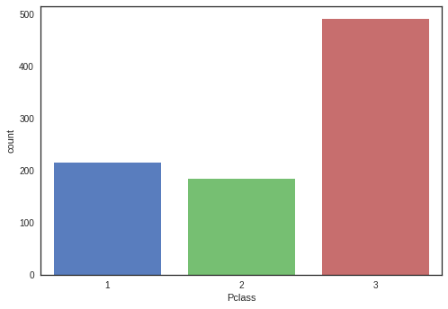


```python
#Pclass, Sex, Cabin, Embarked, Sibsp/Parch
sns.barplot(x='Sex', y='Survived', hue='Pclass', data=df_original)
```


    <matplotlib.axes._subplots.AxesSubplot at 0x7f2b50101bd0>


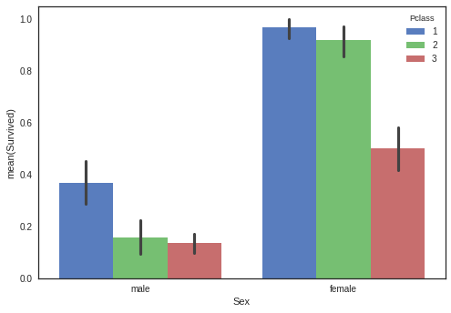


#### 3.2.3 "Embarked"


```python
sns.countplot(x="Embarked", data=df_original)
```


    <matplotlib.axes._subplots.AxesSubplot at 0x7f2b500d0d50>


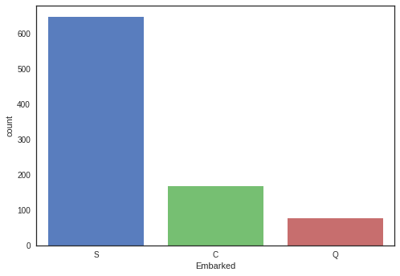


#### 3.2.4 "Cabin"
"Cabin" values are needed to be groupped by their upper group like deck "C", "D".


```python
def substrings_in_string(big_string, substrings):
    for s in substrings:
        if string.find(big_string, s) != -1: ## if not found return -1
            return s
    return np.nan
# Training data
df_original.Cabin = df_original.Cabin.fillna("Unknown")
cabin_list = ['A', 'B', 'C', 'D', 'E', 'F', 'T', 'G', 'Unknown']
df_original['Deck']=df_original['Cabin'].map(lambda x: substrings_in_string(x, cabin_list))
sns.countplot(x='Deck', data=df_original)
df_original = df_original.drop(['Cabin'], axis = 1)
# Test data
df_test.Cabin = df_test.Cabin.fillna("Unknown")
df_test['Deck']=df_test['Cabin'].map(lambda x: substrings_in_string(x, cabin_list))
df_test = df_test.drop(['Cabin'], axis = 1)
```


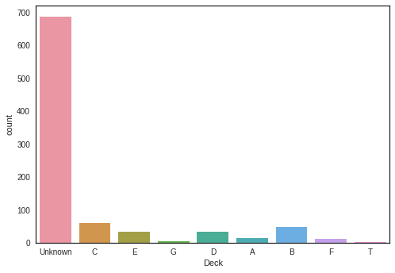


#### 3.2.5 "SibSp"


```python
sns.countplot(x='SibSp', data=df_original)
```


    <matplotlib.axes._subplots.AxesSubplot at 0x7f2b502e1f10>


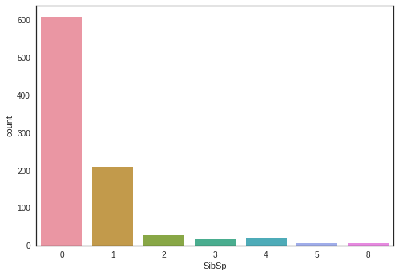


#### 3.2.6 "Parch"


```python
sns.countplot(x='Parch', data=df_original)
```


    <matplotlib.axes._subplots.AxesSubplot at 0x7f2b507b0450>


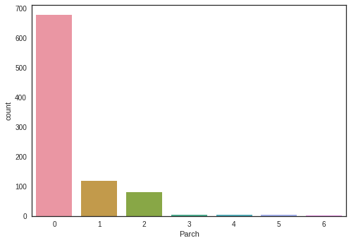


We might need to combine SibSp and Parch into Faimly_Size


```python
# Training data
df_original['Family_Size'] = df_original['SibSp'] + df_original['Parch']
# Test data
df_test['Family_Size'] = df_test['SibSp'] + df_test['Parch']
```

_ _ _
### 3.3 Convert categorical variables into numeric 


```python
# Training data
# Male : 1 Female : 0
temp_sex_col = df_original["Sex"]
df_original.ix[:, "Sex"] = preprocessing.LabelEncoder().fit_transform(df_original["Sex"])
## np.newaxis is to increase the dimension
#OneHotEncoder.fit_transform()(matrix) : <891x3 sparse matrix of type '<type 'numpy.float64'>'with 891 stored elements in Compressed Sparse Row format>
#891X3 sparse matrix.toarray():[0,1,0], 2:[1, 0, 0] [0,0,1] form
dfX2 = pd.DataFrame(OneHotEncoder().fit_transform(df_original["Pclass"].as_matrix()[:,np.newaxis]).toarray(), 
                    columns=['first_class', 'second_class', 'third_class'], index=df_original.index)
df_original = pd.concat([df_original, dfX2], axis=1)
del(df_original["Pclass"])
# Embarked
df_original.ix[:, "Embarked"] = preprocessing.LabelEncoder().fit_transform(df_original["Embarked"])

# Test data
temp_sex_col_t = df_test["Sex"]
df_test.ix[:, "Sex"] = preprocessing.LabelEncoder().fit_transform(df_test["Sex"])
dfX2_t = pd.DataFrame(OneHotEncoder().fit_transform(df_test["Pclass"].as_matrix()[:,np.newaxis]).toarray(), 
                 columns=['first_class', 'second_class', 'third_class'], index=df_test.index)
df_test = pd.concat([df_test, dfX2_t], axis=1)
del(df_test["Pclass"])
df_test.ix[:, "Embarked"] = preprocessing.LabelEncoder().fit_transform(df_test["Embarked"])
```


```python
#['A', 'B', 'C', 'D', 'E', 'F', 'G', 'T', 'Unknown'] [1,2, 3, 4, 5, 6, 7, 8]
# Training data
df_original.ix[:, "Deck"] = preprocessing.LabelEncoder().fit_transform(df_original["Deck"])
# Test data
df_test.ix[:, "Deck"] = preprocessing.LabelEncoder().fit_transform(df_test["Deck"])
```

_ _ _
### 3.4 Correlation of features


```python
corr = df_original.corr()
fig, ax = plt.subplots(figsize=(20,20))
sns.heatmap(corr, vmax=1, square = True, annot = True, fmt='.4g', ax = ax)
```


    <matplotlib.axes._subplots.AxesSubplot at 0x7f2b4bd8f290>


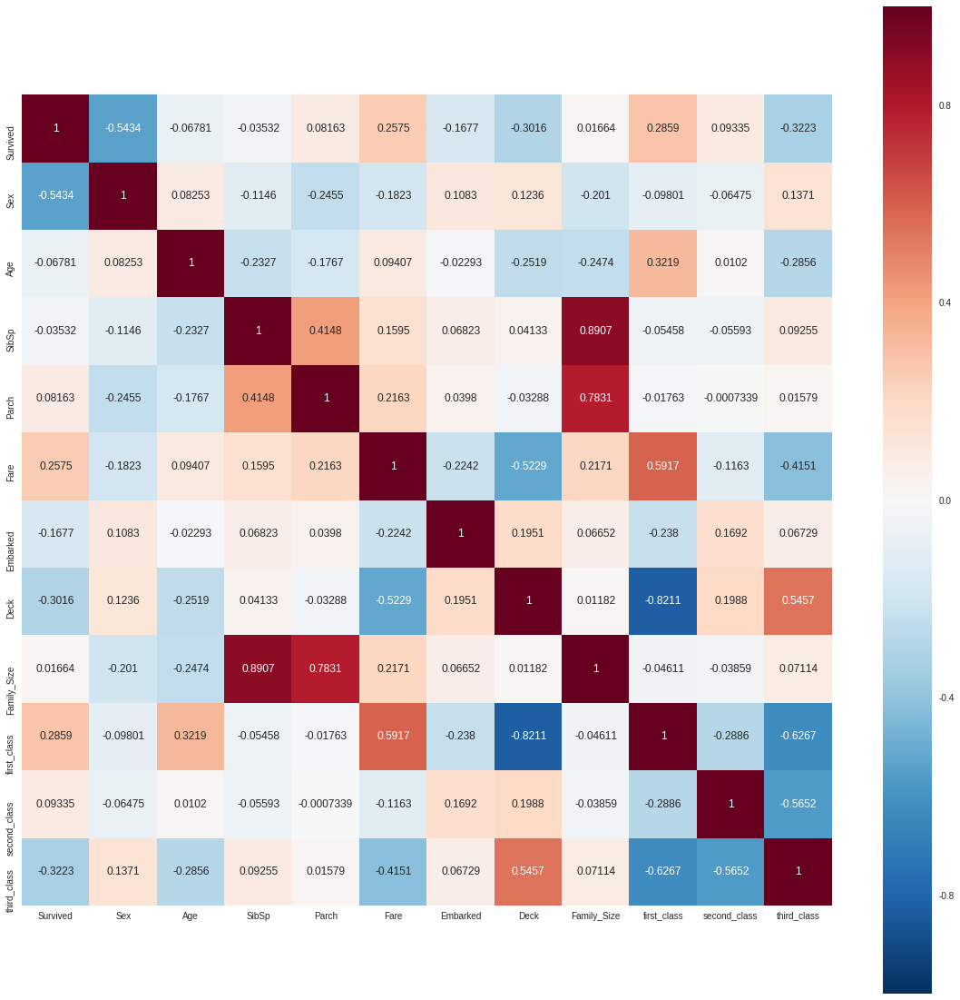


```python
df_original.corr()['Survived']
```


    Survived        1.000000
    Sex            -0.543351
    Age            -0.067809
    SibSp          -0.035322
    Parch           0.081629
    Fare            0.257482
    Embarked       -0.167675
    Deck           -0.301570
    Family_Size     0.016639
    first_class     0.285904
    second_class    0.093349
    third_class    -0.322308
    Name: Survived, dtype: float64


#### 3.4.1 Feature cleaning

* delete "SibSp" and "Parch"
* Sex will be divided by three features including "Child"


```python
### Modify : drop "SibSp", "Parch"
# Training data
df_original = df_original.drop(['SibSp', "Parch"], axis = 1)
# Test data
df_test = df_test.drop(['SibSp', "Parch"], axis = 1)
```


```python
# average survived passengers by age
f, ax = plt.subplots(1,1,figsize=(40,10))
average_age = df_original[["Age", "Survived"]].groupby(['Age'],as_index=False).mean()
sns.barplot(x='Age', y='Survived',color = 'g', data=average_age)
```


    <matplotlib.axes._subplots.AxesSubplot at 0x7f2b4bd30c90>


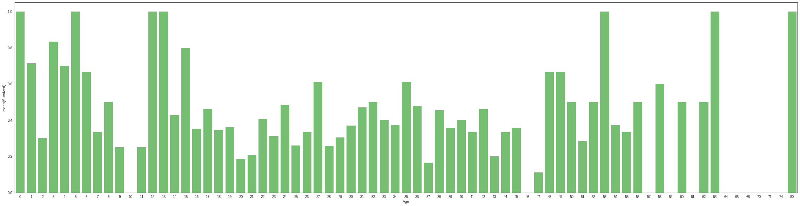


Age < 16 looks like high chances for surviva, so new feature is necessary


```python
### Age < 16 looks like high chances for survival
def get_person(passenger):
    age, sex = passenger
    return 'child' if age < 16 else sex
# Training data
del(df_original['Sex'])
df_original = pd.concat([df_original, temp_sex_col], axis=1)
df_original['Person'] = df_original[['Age', "Sex"]].apply(get_person, axis=1)
df_original = df_original.drop(['Sex'], axis = 1)
# 1: Male, 0: Female, 2: Child
sns.barplot(x='Person', y="Survived", data = df_original, order=["male","female","child"])

# Test data
del(df_test["Sex"])
df_test = pd.concat([df_test, temp_sex_col_t], axis=1)
df_test["Person"] = df_test[["Age", "Sex"]].apply(get_person, axis=1)
df_test = df_test.drop(["Sex"], axis=1)
```


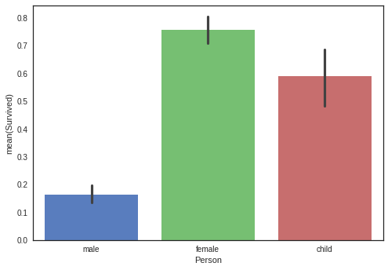


```python
# Person dummies variables
# Training data
person_dummies_origin = pd.get_dummies(df_original["Person"])
person_dummies_origin.columns = ["Child", "Female", "Male"]
### drop Male because it has seldomly affect survived passengers
person_dummies_origin.drop(["Male"], axis = 1, inplace=True)
df_original = df_original.join(person_dummies_origin)

# Test data
person_dummies_test = pd.get_dummies(df_test["Person"])
person_dummies_test.columns = ["Child", "Female", "Male"]
person_dummies_test.drop(["Male"], axis = 1, inplace=True)
df_test = df_test.join(person_dummies_test)
```

Male might be needed to delete, because it has sedomly affect survived rate.


```python
# Training data
df_original.drop(["Person"], axis=1, inplace = True)
# Test data
df_test.drop(["Person"], axis=1, inplace = True)
```


```python
### drop third class
# Training data
df_original.drop(["third_class"], axis=1, inplace = True)
# Test data
df_test.drop(["third_class"], axis=1, inplace = True)
```


## 4. Final Dataset


```python
# Training data
df_original[["Age", "Fare"]] = df_original_std_Age_Fare
# Test data
df_test[["Age", "Fare"]] = df_test_std_Age_Fare
```


```python
df_original.tail()
```


<div>
<table border="1" class="dataframe">
  <thead>
    <tr style="text-align: right;">
      <th></th>
      <th>Survived</th>
      <th>Age</th>
      <th>Fare</th>
      <th>Embarked</th>
      <th>Deck</th>
      <th>Family_Size</th>
      <th>first_class</th>
      <th>second_class</th>
      <th>Child</th>
      <th>Female</th>
    </tr>
  </thead>
  <tbody>
    <tr>
      <th>886</th>
      <td>0</td>
      <td>-0.195620</td>
      <td>-0.378164</td>
      <td>2</td>
      <td>8</td>
      <td>0</td>
      <td>0.0</td>
      <td>1.0</td>
      <td>0</td>
      <td>0</td>
    </tr>
    <tr>
      <th>887</th>
      <td>1</td>
      <td>-0.810699</td>
      <td>-0.035946</td>
      <td>2</td>
      <td>1</td>
      <td>0</td>
      <td>1.0</td>
      <td>0.0</td>
      <td>0</td>
      <td>1</td>
    </tr>
    <tr>
      <th>888</th>
      <td>0</td>
      <td>-0.041851</td>
      <td>-0.176859</td>
      <td>2</td>
      <td>8</td>
      <td>3</td>
      <td>0.0</td>
      <td>0.0</td>
      <td>0</td>
      <td>1</td>
    </tr>
    <tr>
      <th>889</th>
      <td>1</td>
      <td>-0.272505</td>
      <td>-0.035946</td>
      <td>0</td>
      <td>2</td>
      <td>0</td>
      <td>1.0</td>
      <td>0.0</td>
      <td>0</td>
      <td>0</td>
    </tr>
    <tr>
      <th>890</th>
      <td>0</td>
      <td>0.188804</td>
      <td>-0.498948</td>
      <td>1</td>
      <td>8</td>
      <td>0</td>
      <td>0.0</td>
      <td>0.0</td>
      <td>0</td>
      <td>0</td>
    </tr>
  </tbody>
</table>
</div>


```python
df_test.tail()
```


<div>
<table border="1" class="dataframe">
  <thead>
    <tr style="text-align: right;">
      <th></th>
      <th>PassengerId</th>
      <th>Age</th>
      <th>Fare</th>
      <th>Embarked</th>
      <th>Deck</th>
      <th>Family_Size</th>
      <th>first_class</th>
      <th>second_class</th>
      <th>Child</th>
      <th>Female</th>
    </tr>
  </thead>
  <tbody>
    <tr>
      <th>413</th>
      <td>1305</td>
      <td>-0.015143</td>
      <td>-0.486368</td>
      <td>2</td>
      <td>7</td>
      <td>0</td>
      <td>0.0</td>
      <td>0.0</td>
      <td>0</td>
      <td>0</td>
    </tr>
    <tr>
      <th>414</th>
      <td>1306</td>
      <td>0.696941</td>
      <td>1.306100</td>
      <td>0</td>
      <td>2</td>
      <td>0</td>
      <td>1.0</td>
      <td>0.0</td>
      <td>0</td>
      <td>1</td>
    </tr>
    <tr>
      <th>415</th>
      <td>1307</td>
      <td>0.617821</td>
      <td>-0.504292</td>
      <td>2</td>
      <td>7</td>
      <td>0</td>
      <td>0.0</td>
      <td>0.0</td>
      <td>0</td>
      <td>0</td>
    </tr>
    <tr>
      <th>416</th>
      <td>1308</td>
      <td>-0.015143</td>
      <td>-0.486368</td>
      <td>2</td>
      <td>7</td>
      <td>0</td>
      <td>0.0</td>
      <td>0.0</td>
      <td>0</td>
      <td>0</td>
    </tr>
    <tr>
      <th>417</th>
      <td>1309</td>
      <td>-0.015143</td>
      <td>-0.235422</td>
      <td>0</td>
      <td>7</td>
      <td>2</td>
      <td>0.0</td>
      <td>0.0</td>
      <td>0</td>
      <td>0</td>
    </tr>
  </tbody>
</table>
</div>


```python
dfX = df_original.drop("Survived", axis=1)
dfy = df_original["Survived"]
#X_train, X_test, y_train, y_test = train_test_split(dfX, dfy, test_size=.25, random_state = 256)
Test_dfX = df_test.drop("PassengerId", axis = 1)
```

## 5. Model fitting and evaluation


```python
gn = GaussianNB()
scores = cross_val_score(gn, dfX, dfy, cv =5)
scores
```


    array([ 0.70949721,  0.75418994,  0.80337079,  0.81460674,  0.84745763])


```python
gn.fit(dfX, dfy)
Y_pred_gn = gn.predict(Test_dfX)
```


```python
logreg = LogisticRegression()
scores = cross_val_score(logreg, dfX, dfy, cv=5)
scores
```


    array([ 0.84357542,  0.79329609,  0.79213483,  0.81460674,  0.84745763])


```python
logreg.fit(dfX, dfy)
Y_pred_logreg = logreg.predict(Test_dfX)
```


```python
svc = SVC()
scores = cross_val_score(svc, dfX, dfy, cv = 5)
scores
```


    array([ 0.80446927,  0.80446927,  0.80898876,  0.82022472,  0.86440678])


```python
svc.fit(dfX, dfy)
Y_pred_svc = svc.predict(Test_dfX)
```


```python
lsvc = LinearSVC()
scores = cross_val_score(lsvc, dfX, dfy, cv = 5)
scores
```


    array([ 0.82681564,  0.80446927,  0.80898876,  0.80898876,  0.8700565 ])


```python
lsvc.fit(dfX, dfy)
Y_pred_lsvc = lsvc.predict(Test_dfX)
```


```python
rf = RandomForestClassifier(criterion='entropy', n_estimators=100)
scores = cross_val_score(rf, dfX, dfy, cv = 5)
scores
```


    array([ 0.80446927,  0.79888268,  0.83707865,  0.80898876,  0.83615819])


```python
rf.fit(dfX, dfy)
Y_pred_rf = rf.predict(Test_dfX)
```


```python
Et = ExtraTreesClassifier(criterion='entropy', n_estimators=100)
scores = cross_val_score(Et, dfX, dfy, cv = 5)
scores
```


    array([ 0.78212291,  0.77653631,  0.81460674,  0.79213483,  0.84180791])


```python
Et.fit(dfX, dfy)
Y_pred_Et = Et.predict(Test_dfX)
```

## 5. Prediction submit


```python
def make_csv(y_pred):
    submit = pd.DataFrame({
        "PassengerId" : df_test["PassengerId"], 
        "Survived" : y_pred
    })
    return submit
```


```python
pred_list = [Y_pred_gn, Y_pred_logreg, Y_pred_svc,
             Y_pred_lsvc, Y_pred_rf, Y_pred_Et]
pred_list_name = ["Y_pred_gn", "Y_pred_logreg", "Y_pred_svc",
             "Y_pred_lsvc", "Y_pred_rf", "Y_pred_Et"]

for i in range(6):
    a = make_csv(pred_list[i])
    a.to_csv("{}.csv".format(pred_list_name[i]), index = False)
```
